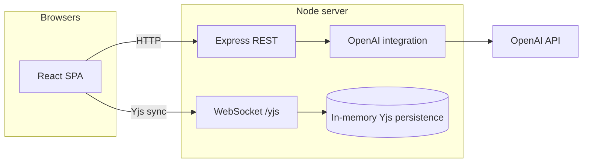
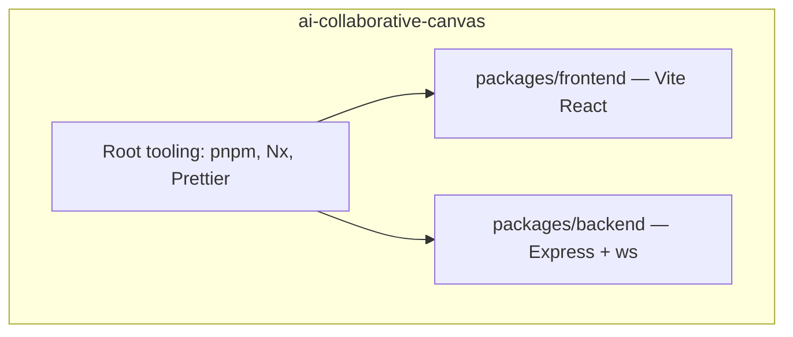
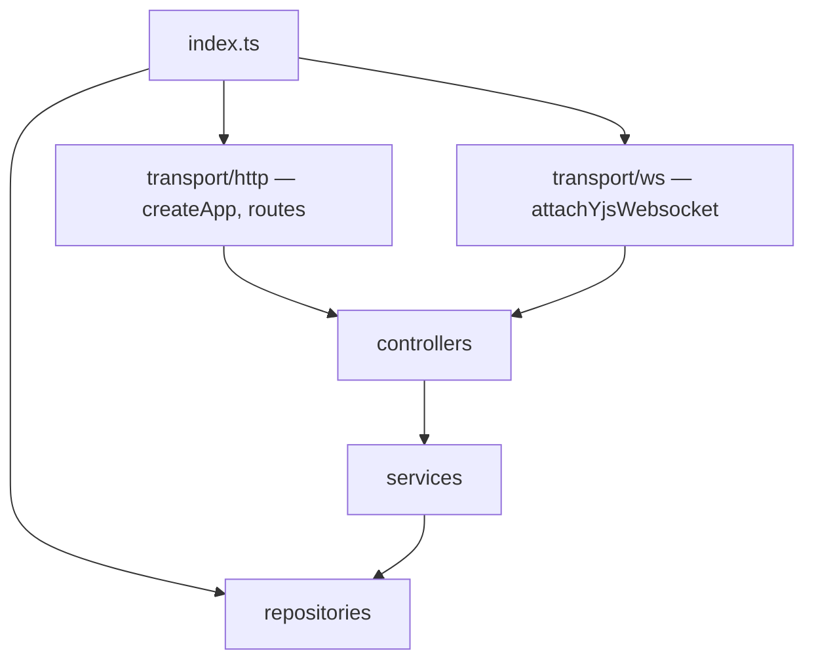
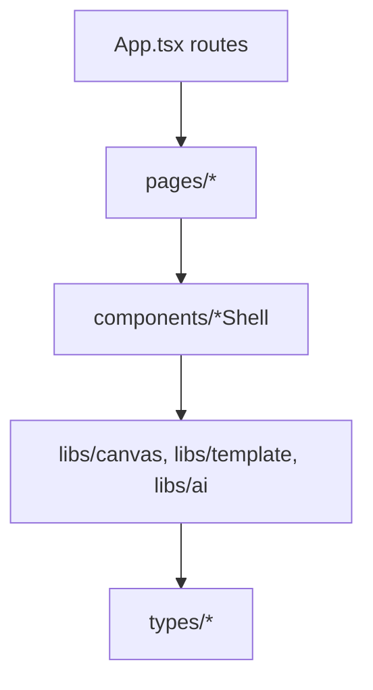
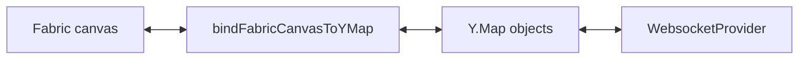
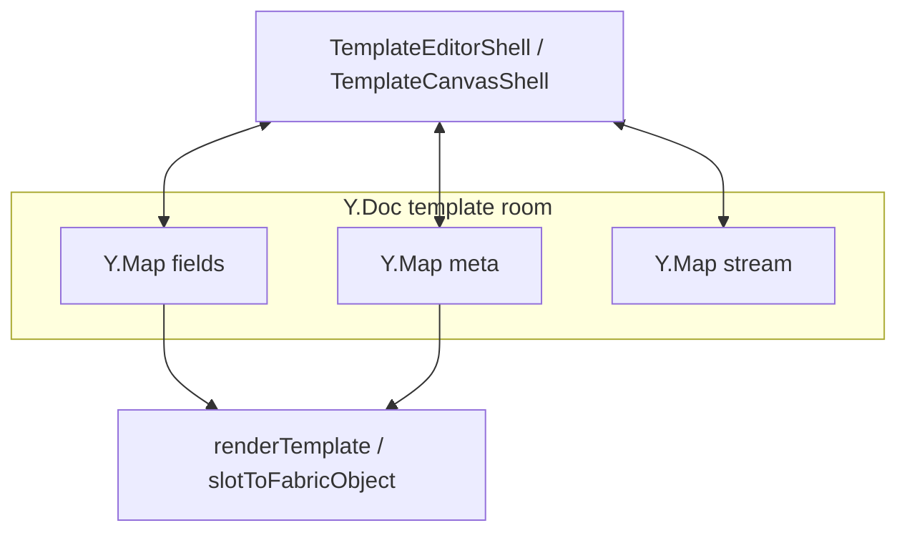
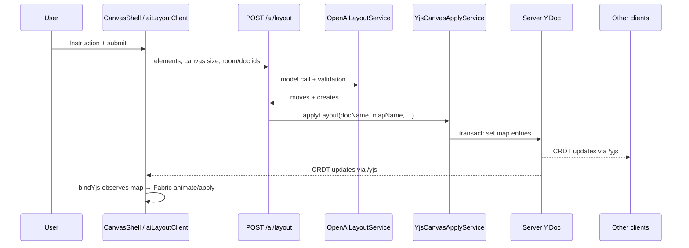
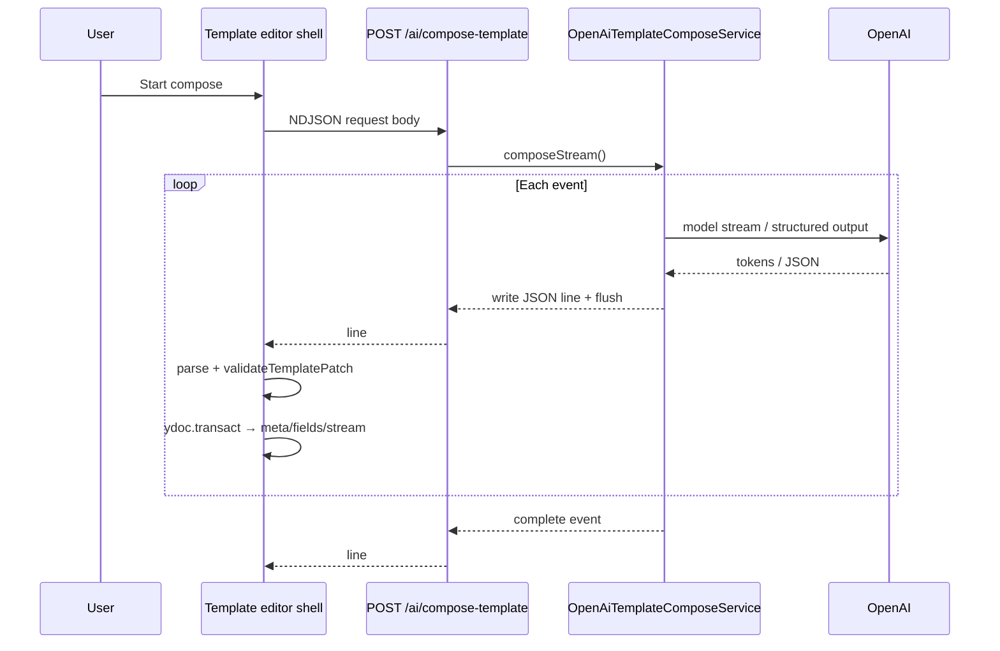
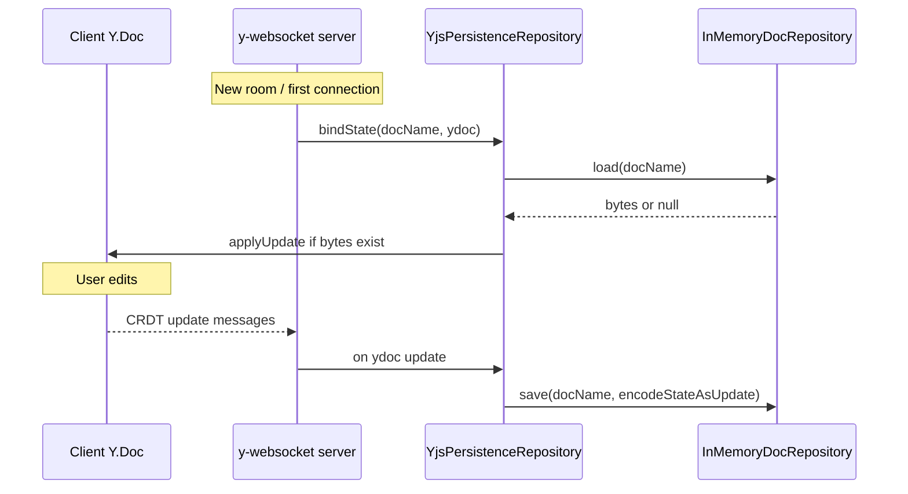

# AI Collaborative Canvas

Real-time collaborative canvas and AI-assisted design prototype: **Fabric.js** editing, **Yjs** CRDT sync over WebSocket, and **OpenAI** integration for canvas layout (`/ai/layout`) and streaming template composition (`/ai/compose-template`). The server applies AI output into the same Yjs documents clients already share.

**License:** MIT · **Package manager:** pnpm workspaces

---

<!-- Explicit <h2 id> so TOC fragments work in GitHub, VS Code, and Cursor previews (auto-slugs differ). -->
<h2 id="table-of-contents">Table of contents</h2>

1. [Overview](#overview)
2. [Features](#features)
3. [Technology stack](#technology-stack)
4. [Architecture](#architecture)
5. [Data flows and contracts](#data-flows-and-contracts)
6. [Collaboration and Yjs](#collaboration-and-yjs)
7. [Canvas and Fabric binding](#canvas-and-fabric-binding)
8. [Template domain](#template-domain)
9. [HTTP APIs and AI pipelines](#http-apis-and-ai-pipelines)
10. [Project structure](#project-structure)
11. [Repository conventions](#repository-conventions)
12. [Getting started](#getting-started)
13. [Configuration](#configuration)
14. [Scripts](#scripts)
15. [Routing and document rooms](#routing-and-document-rooms)
16. [Key file index](#key-file-index)
17. [Operations and limitations](#operations-and-limitations)
18. [Terminology](#terminology)
19. [Further reading](#further-reading)

---

<h2 id="overview">Overview</h2>

This monorepo contains:

- **`packages/frontend`** — Vite + React SPA: collaborative canvas, design/template editor, Fabric rendering, Yjs client (`WebsocketProvider`), fetch clients for REST and NDJSON streams.
- **`packages/backend`** — Single Node process: Express (REST), `ws` + `y-websocket` on `/yjs`, OpenAI services, Zod validation, in-memory persistence of Yjs state.

There are **no cross-package TypeScript imports**; HTTP and WebSocket payloads are the contract between frontend and backend (types duplicated per package).

---

<h2 id="features">Features</h2>

| Area | Description |
|------|-------------|
| **Collaborative canvas** (`/canvas`) | Fabric scene synced via `Y.Map<string, CanvasObjectRecord>`; local edits serialize to Yjs; remote updates rehydrate Fabric (bulk updates can animate). |
| **AI layout** | User instruction + canvas snapshot → `POST /ai/layout` → OpenAI → server writes moves/creates into the live server `Y.Doc` → all tabs converge over `/yjs`. |
| **Design flow** (`/design`) | Prompt entry, optional template candidate narrowing via chips, navigation to editor with `docId`. |
| **Template composition** (`/design/editor`) | NDJSON stream fills `TemplateFields` and `TemplateMeta` in Yjs; deterministic slot layout from `TemplateSchema`; Fabric/template shells (`TemplateCanvasShell`, `TemplateEditorShell`) and design tokens. |
| **Visual regression** (`/design/visual-regression`) | Exercises template rendering for visual checks. |
| **Persistence** | `YjsPersistenceRepository` + `InMemoryDocRepository`: load/save `encodeStateAsUpdate` per doc name (non-durable across backend restart). |

---

<h2 id="technology-stack">Technology stack</h2>

| Layer | Choices |
|-------|---------|
| **Monorepo** | pnpm workspaces (`pnpm-workspace.yaml`); Nx listed as optional tooling in root devDependencies. |
| **Frontend** | React 19, Vite, React Router, Fabric.js, Yjs, `y-websocket` client. **ESM**; local imports often use explicit `.ts`/`.tsx` extensions. |
| **Backend** | Node, Express, `ws`, `y-websocket` server utils, OpenAI SDK, Zod, `dotenv`. |
| **Styling** | CSS modules alongside shell components. |

---

<h2 id="architecture">Architecture</h2>

### System context



### Logical containers



| Container | Technology | Responsibility |
|-----------|------------|----------------|
| Frontend | Vite, React, Fabric.js, Yjs client | UI, canvas editing, template preview, REST + NDJSON clients |
| Backend | Node, Express, ws, y-websocket | REST APIs, WebSocket sync, OpenAI, ephemeral Yjs storage |

### Backend layering



**Dependency direction:** `transport → controllers → services → (repositories, utils, OpenAI SDK)`. Controllers adapt Express `Request`/`Response` to plain inputs; keep transport types out of core services where possible.

**Entrypoint (`packages/backend/src/index.ts`):** loads env, creates `http.Server`, `setPersistence` with `YjsPersistenceRepository`, `YjsCollabService`, attaches WebSocket on `/yjs`, listens on `PORT`.

### Frontend composition



**State:** collaborative state lives in **Yjs**; local UI uses React state/refs (tools, selection, loading, layout scale).

### Collaborative canvas (structural)

The canvas treats **`Y.Map` of `CanvasObjectRecord`** as source of truth; Fabric is the view.



### Template editor (structural)

Template collaboration uses **three maps** for metadata, field content, and stream idempotency:



---

<h2 id="data-flows-and-contracts">Data flows and contracts</h2>

### Canvas AI layout sequence



**Principle:** The model does not push pixels to the browser; it mutates the **same CRDT** every client shares, so AI and human edits merge uniformly.

### Template compose streaming sequence



### Yjs persistence lifecycle (server)



### Wire artifacts

| Artifact | Direction | Format |
|----------|-----------|--------|
| Yjs updates | Client ↔ Server | Binary CRDT over WebSocket |
| AI layout request | Client → Server | JSON (`aiLayoutRequestSchema`) |
| AI layout response | Server → Client | JSON (validated plan; **also applied server-side**) |
| Template compose request | Client → Server | JSON (`templateComposeRequestSchema`) |
| Template compose response | Server → Client | NDJSON (`application/x-ndjson`) |
| Persisted document | Server ↔ Memory | `Uint8Array` per doc name via `encodeStateAsUpdate` |

---

<h2 id="collaboration-and-yjs">Collaboration and Yjs</h2>

| Concept | Detail |
|---------|--------|
| **CRDT** | Conflict-free replicated data; concurrent edits merge without custom last-write-wins for map updates. |
| **`Y.Doc`** | Root document; emits binary updates. Client: `new Y.Doc()` in `bindYjsToFabricCanvas`; server: one doc per room via `y-websocket`. |
| **`Y.Map`** | Canvas: keys = stable object ids, values = `CanvasObjectRecord`. Template: `meta`, `fields`, `stream` maps. |
| **Room / doc name** | Query `?doc=` on `ws://host/yjs`. `YjsCollabService.getDocName` reads it (default `default`). Must match AI layout `doc` field. |
| **`y-websocket`** | Client: `WebsocketProvider`. Server: `setupWSConnection`; `setPersistence` registers load/save. |
| **`getYDoc(docName)`** | Server registry of live `Y.Doc`s. `YjsCanvasApplyService` uses it so **server-side AI layout** mutates the document clients sync. |
| **`ydoc.transact`** | Batches mutations (AI apply, template patches, compose reset). |
| **Sync event** | When `WebsocketProvider` reports synced, canvas binding runs `applyFromYjs` to reconcile. |
| **Template idempotency** | `stream` map stores `op:<opId>` so duplicate NDJSON events are not applied twice. Stage completion uses `done:<stageId>`. |

---

<h2 id="canvas-and-fabric-binding">Canvas and Fabric binding</h2>

| Item | Detail |
|------|--------|
| **Fabric.js** | `FabricObject` with events (`object:moving`, `object:scaling`, `text:changed`, …) driving Yjs upserts. |
| **Stable ids** | `fabricRecords.ts` helpers read/write ids used as `Y.Map` keys (including grouped selection targets). |
| **`CanvasObjectRecord`** | `kind`, `left`/`top`, `scaleX`/`scaleY`, `angle`, optional `fill`, `text`, line/table payloads; optional `coordSpace: 'page'` for template page coordinates (`packages/frontend/src/types/canvas.ts`). |
| **`bindFabricCanvasToYMap`** | Bidirectional bind: remote walk creates/updates/removes Fabric objects; local events upsert/delete map entries; optional `shouldPreserveObject` for non-synced template chrome; bulk remote changes can **animate** position. |
| **`bindYjsToFabricCanvas`** | Creates `Y.Doc` + `WebsocketProvider` + default `objects` map + `bindFabricCanvasToYMap`. |
| **Factories / viewport** | `fabricFactories.ts`, `viewport.ts` (keep content in view after resize or AI moves). |
| **Templates on Fabric** | `renderTemplate`, `templateCanvasFabric`, `slotToFabricObject` (`Design System/`) bridge slots + fields to Fabric; selective sync for some ids. |

---

<h2 id="template-domain">Template domain</h2>

| Concept | Detail |
|---------|--------|
| **Template pack** | `TemplateSchema`: `templateId`, page size, `slots[]`; registered in `templatePacks.ts`, `templatePackV1.ts`, constants. |
| **`TemplateId` / `TemplateTheme`** | Allowlisted ids and themes (`templateRegistry`); enforced in UI, client stream parser, and backend Zod/policy. |
| **Slot** | Typed region (`text`, `pill`, `box`, `connector`, `logo`, `cta`), geometry, `maxChars` / `maxLines` / `overflow`, optional `componentKind`. |
| **`TemplateFields`** | Single shared field shape across packs (hero, logos, steps, math, final CTA, …); AI streams partial updates. |
| **`TemplateMeta`** | `templateId`, `theme`, `status` (`idle` \| `streaming` \| `complete` \| `error`), `schemaVersion`. |
| **`TemplatePatch`** | `opId`, `stage` (`meta_header`, `steps`, `math`, `complete`), optional `meta` / `fields`; validated by `validateTemplatePatch` (`contracts.ts`). |
| **Rendering** | `renderTemplate` / `renderTemplateWithDiagnostics` → `CanvasObjectRecord[]` + diagnostics; tokens in `templateDesignTokens.ts`, `templateLandingPalettes.ts`. |
| **Shells** | `DesignShell` (chips, `docId`, candidates). `TemplateEditorShell` (Yjs + compose + HTML-style preview path). `TemplateCanvasShell` (Fabric-first + viewport helpers). |
| **`docId`** | Client-generated; `?doc=` for shared template sessions. |
| **Fallbacks / mock** | `templateFieldFallbacks.ts`, `mockStream.ts` for offline-ish demos. |
| **Backend policy** | `templatePackPolicy`, `templateThemeRotation` constrain model selection to allowed packs/themes. |

---

<h2 id="http-apis-and-ai-pipelines">HTTP APIs and AI pipelines</h2>

### Routes

| Method | Path | Role |
|--------|------|------|
| `GET` | `/health` | Liveness |
| `POST` | `/ai/layout` | OpenAI layout plan; **server applies** to Yjs |
| `POST` | `/ai/compose-template` | **NDJSON** template compose stream |

**Express:** `createApp` — CORS, `express.json()`, `registerRoutes` (`packages/backend/src/transport/http/`).

### AI layout (step-by-step)

1. Client builds `AiLayoutElement[]` via `buildAiLayoutElementsFromCanvas` (Fabric + Yjs records).
2. `POST /ai/layout` with instruction, canvas size, `doc`, `mapName`, `roomId`, elements.
3. Optional **conversation history** per `roomId` from `conversationStore`.
4. `OpenAiLayoutService` → OpenAI → Zod-validated result.
5. `YjsCanvasApplyService.applyLayout`: **moves** patch `left`/`top` on existing keys; **creates** add new ids + records inside `ydoc.transact`.
6. All clients receive updates on `/yjs`; Fabric binding animates when many keys change.

### Template compose (step-by-step)

1. `streamTemplateCompose` → `fetch` `/ai/compose-template` with `prompt`, `templateCandidates`, optional `themeHint`, `brandHints`.
2. Response: `application/x-ndjson`, flush-friendly headers, `AbortController` on disconnect.
3. Client: `ReadableStream` + line split + JSON parse per line.
4. Events: `template_selected`, `field_patch`, `complete`, `error` (`TemplateComposeEvent`).
5. Valid patches applied in `ydoc.transact` to `meta` / `fields` / `stream` with `validateTemplatePatch`.

**NDJSON:** one JSON object per line — incremental UX and proxy-friendly flushing.

**Secrets:** OpenAI key from env or `Authorization: Bearer` (`openAiAuth.ts`); keys never ship to the browser for these flows.

---

<h2 id="project-structure">Project structure</h2>

```
ai-collaborative-canvas/
├── package.json
├── pnpm-workspace.yaml
├── CONTEXT.md                 # Product / roadmap context (Moda PoW, template roadmap)
├── doc/                       # Split mirrors: architecture.md, concepts/*.md (optional deep dives)
├── docs/                      # Legacy feature notes (e.g. template sync, compose TODO)
├── scripts/
└── packages/
    ├── frontend/
    │   └── src/
    │       ├── main.tsx, App.tsx
    │       ├── pages/
    │       ├── components/     # Shells, FabricCanvas, PromptBar, …
    │       ├── libs/canvas/, libs/template/, libs/ai/
    │       ├── Design System/  # Tokens, slotToFabricObject, palettes
    │       ├── types/, constants/
    │       └── assets/, *.css
    └── backend/
        └── src/
            ├── index.ts
            ├── transport/http/, transport/ws/
            ├── controllers/
            ├── services/
            ├── repositories/
            ├── schemas/, types/
            ├── prompts/, utils/, constants/
```

---

<h2 id="repository-conventions">Repository conventions</h2>

- **Thin React shells** — Orchestration in `components/`; logic in `libs/`.
- **No frontend↔backend deep imports** — Align types manually or introduce a future shared package.
- **Zod at HTTP boundary** — `packages/backend/src/schemas/*`.
- **Default API/WS URLs** — Hard-coded `http://localhost:4000` and `ws://localhost:4000` in shells (candidates for env-based config).

---

<h2 id="getting-started">Getting started</h2>

### Prerequisites

- **Node.js** (recent LTS)
- **pnpm**

### Installation

```bash
pnpm install
```

### Run (frontend + backend)

```bash
pnpm dev
```

- Backend: `http://localhost:4000` — WebSocket: `ws://localhost:4000/yjs?doc=<room>`
- Frontend: Vite prints the URL (commonly `http://localhost:5173`)

---

<h2 id="configuration">Configuration</h2>

Create **`packages/backend/.env`**:

```bash
OPENAI_API_KEY=your_key_here
# Optional:
# PORT=4000
# OPENAI_MODEL=gpt-4o-mini
```

The server accepts the API key from **`OPENAI_API_KEY`** or **`Authorization: Bearer <key>`** on requests.

---

<h2 id="scripts">Scripts</h2>

| Command | Description |
|---------|-------------|
| `pnpm dev` | Frontend + backend concurrently |
| `pnpm dev:frontend` | Vite only |
| `pnpm dev:backend` | Node server only |
| `pnpm build` | Frontend production build + backend build |
| `pnpm start` | Start backend (after build, per root `package.json`) |
| `pnpm typecheck` | Frontend build (dev mode) + backend typecheck |
| `pnpm format:check` / `pnpm format:fix` | Prettier |
| `pnpm check:deps` | Shared dependency check script |
| `pnpm find:process` | Lists process listening on TCP 4000 (local debugging) |

---

<h2 id="routing-and-document-rooms">Routing and document rooms</h2>

| Feature | URL / param | Shared state |
|---------|-------------|--------------|
| Canvas | `/canvas`, WS `?doc=` | Same `doc` + map name for `/ai/layout` |
| Template editor | `/design/editor?doc=` | Yjs room per `doc` |
| Design entry | `/design` | Creates `docId`, passes prompt/candidates via navigation |

---

<h2 id="key-file-index">Key file index</h2>

| Concern | Path |
|---------|------|
| Server boot | `packages/backend/src/index.ts` |
| HTTP routes | `packages/backend/src/transport/http/routes.ts` |
| Yjs WebSocket attach | `packages/backend/src/transport/ws/attachYjsWebsocket.ts` |
| Canvas ↔ Yjs | `packages/frontend/src/libs/canvas/bindYjsToFabric.ts` |
| Fabric records / ids | `packages/frontend/src/libs/canvas/fabricRecords.ts` |
| AI layout client | `packages/frontend/src/libs/ai/aiLayoutClient.ts` |
| Template compose client | `packages/frontend/src/libs/template/composeTemplateClient.ts` |
| Template contracts | `packages/frontend/src/libs/template/contracts.ts` |
| Template stream + Yjs | `packages/frontend/src/components/TemplateEditorShell.tsx` |
| Template types | `packages/frontend/src/types/template.ts` |
| Canvas types | `packages/frontend/src/types/canvas.ts` |

---

<h2 id="operations-and-limitations">Operations and limitations</h2>

| Topic | Note |
|-------|------|
| **Persistence** | In-memory only; **backend restart drops** all Yjs documents unless you plug in durable storage. |
| **OpenAI failures** | Layout: HTTP 500 JSON. Compose: `error` NDJSON line. |
| **CORS** | Enabled in `createApp` for local dev; tighten for production. |
| **Scalability** | Single-process design; horizontal scaling would need shared Yjs persistence and sticky sessions or CRDT sync hub. |

---

<h2 id="terminology">Terminology</h2>

| Term | Meaning |
|------|---------|
| **CRDT** | Conflict-free replicated data type; Yjs implements maps/docs. |
| **Room / doc name** | Yjs document id (WebSocket `?doc=`). |
| **`CanvasObjectRecord`** | Serializable canvas object for `Y.Map` storage. |
| **NDJSON** | Newline-delimited JSON stream for compose. |
| **`op:<opId>`** | Idempotency marker in template `stream` map. |
| **`getYDoc`** | Server-side access to the live `Y.Doc` for a room (AI apply). |
| **`bindFabricCanvasToYMap`** | Low-level Fabric ↔ `Y.Map` sync. |
| **`bindYjsToFabricCanvas`** | Full client setup: doc, provider, default `objects` map. |

A longer A–Z list lives in [`doc/concepts/08-glossary.md`](doc/concepts/08-glossary.md).

---

<h2 id="further-reading">Further reading</h2>

- **[CONTEXT.md](CONTEXT.md)** — Moda proof-of-work framing, template-mode principles, packs roadmap, production rendering direction.
- **`doc/`** — Same architecture and concepts split into smaller files ([`doc/architecture.md`](doc/architecture.md), [`doc/concepts/README.md`](doc/concepts/README.md)) for focused edits and reviews.
