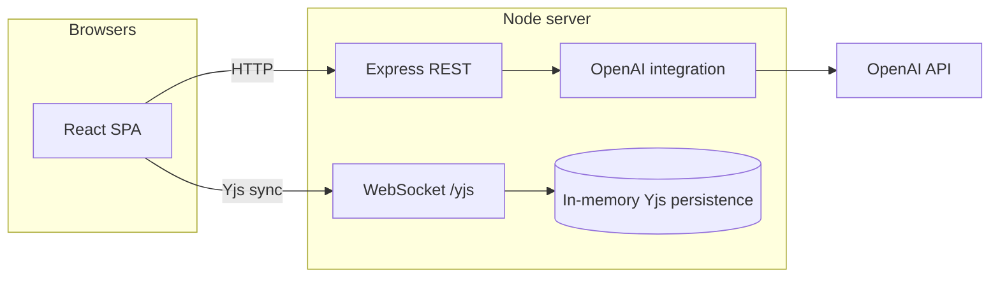
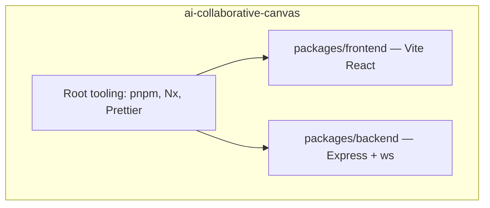
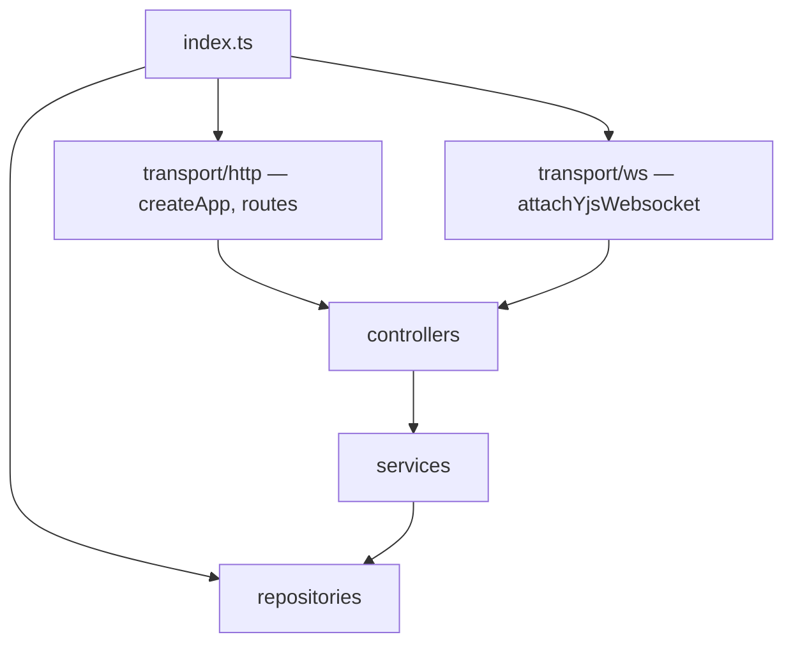
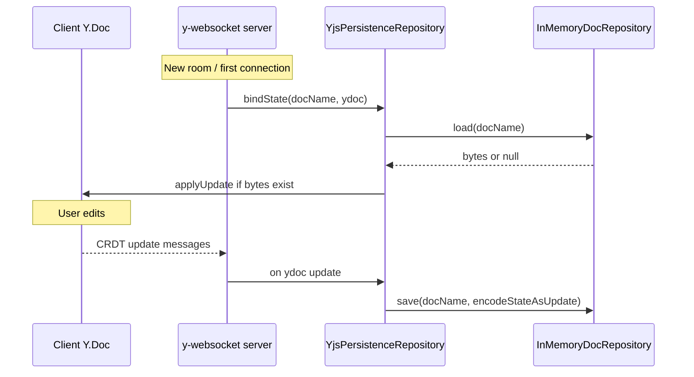
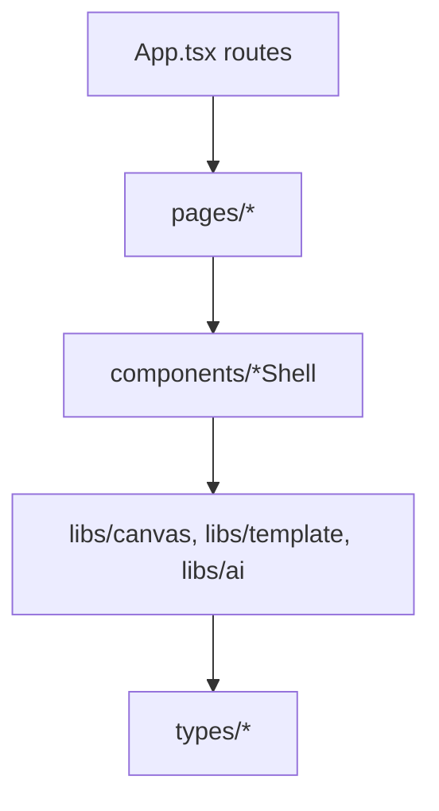
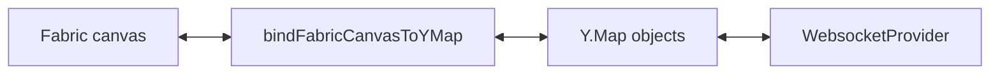
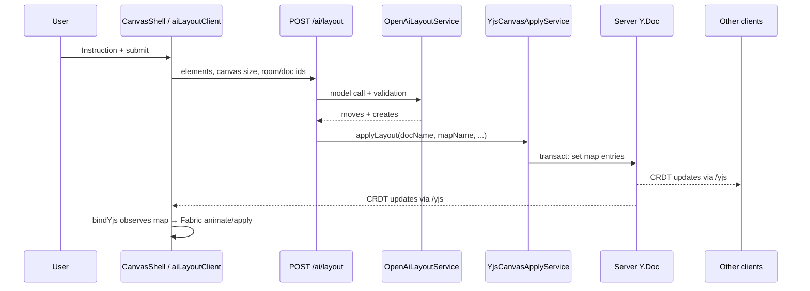
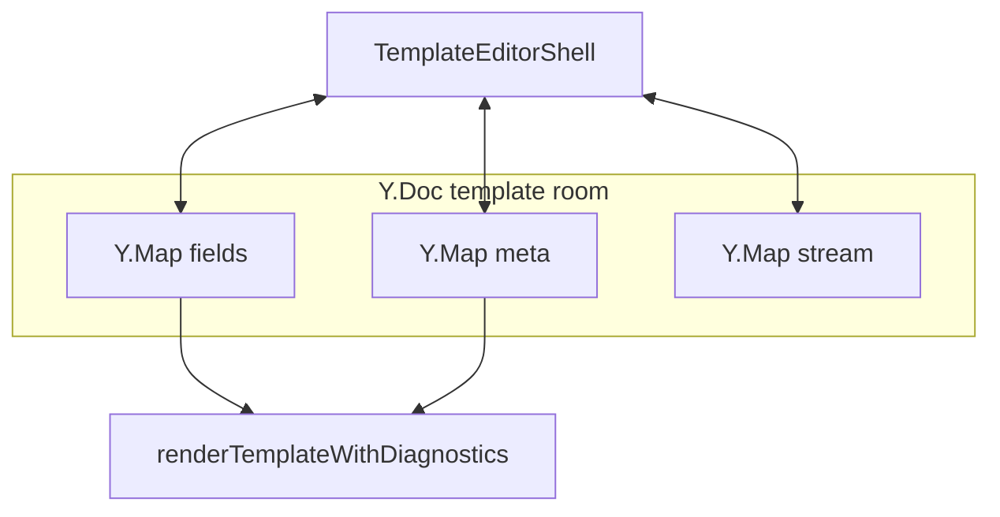
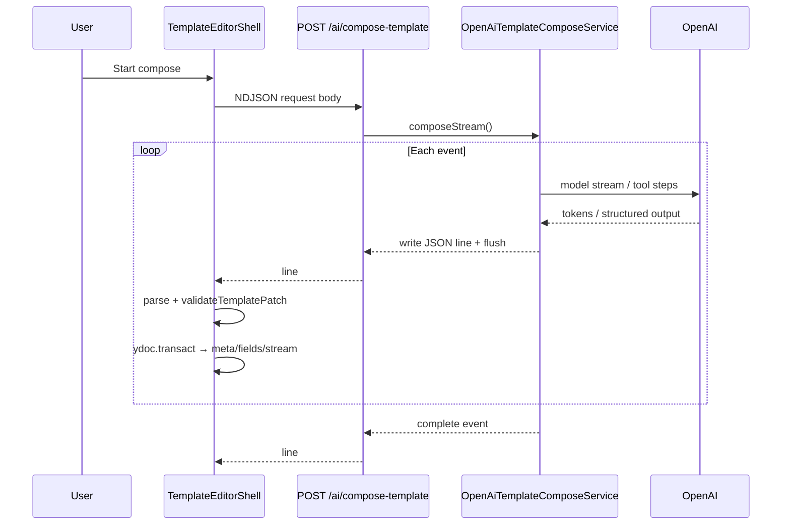

# System architecture

This document describes how **AI Collaborative Canvas** is structured at runtime, how major subsystems interact, and how data flows through collaboration and AI features.

## 1. Goals (what the system does)

1. **Collaborative canvas** — Multiple browsers edit the same Fabric scene; state converges via **Yjs** over **WebSocket**.
2. **AI-assisted layout** — Natural language instructions adjust element positions (and optionally create shapes) by calling **OpenAI** on the server and writing results into the same Yjs document. [Not yet implemented in the design editor].
3. **Template composition** — A structured “landing page” style document is filled incrementally by streaming **NDJSON** events from the server into **Yjs maps**, so all participants see the same evolving copy and metadata.

---

## 2. High-level context

Users interact with a **React (Vite) SPA**. The browser connects to a **Node HTTP server** for REST and to the **`/yjs` WebSocket** for CRDT sync. The server calls **OpenAI** for layout and template generation.

---

## 3. Repository map (logical containers)

| Container | Technology                         | Responsibility                                                 |
| --------- | ---------------------------------- | -------------------------------------------------------------- |
| Frontend  | Vite, React, Fabric.js, Yjs client | UI, canvas editing, template preview, fetch/stream to backend  |
| Backend   | Node, Express, ws, y-websocket     | REST APIs, WebSocket sync, OpenAI calls, ephemeral doc storage |

---

## 4. Backend composition

### 4.1 Persistence and Yjs lifecycle

1. On startup, `setPersistence` registers `YjsPersistenceRepository` so `y-websocket` can **load** prior state and **save** `encodeStateAsUpdate` bytes.
2. Each unique **doc name** (room) gets a `Y.Doc` inside `y-websocket` utilities.
3. `InMemoryDocRepository` stores the latest binary snapshot per doc (lost on process restart).

---

## 5. Frontend composition

---

## 6. Collaborative canvas: structural view

The **canvas** feature treats a `Y.Map` of `CanvasObjectRecord` as authoritative. Fabric reflects that map bidirectionally.

### 6.1 Canvas AI layout sequence

**Key idea**: The model never talks to the browser directly; it mutates the **same CRDT** every client already shares, so AI edits are indistinguishable from human edits at the sync layer.

---

## 7. Template editor: structural view

Template state splits into multiple maps for clarity and idempotent streaming:

### 7.1 Template compose streaming sequence

**Idempotency**: The `stream` map records `op:<opId>` so duplicate events do not double-apply.

---

## 8. Data artifacts (contracts)

| Artifact                  | Direction       | Format                                             |
| ------------------------- | --------------- | -------------------------------------------------- |
| Yjs updates               | Client ↔ Server | Binary CRDT packets over WebSocket                 |
| AI layout request         | Client → Server | JSON (`aiLayoutRequestSchema`)                     |
| AI layout response        | Server → Client | JSON (validated plan; also applied server-side)    |
| Template compose request  | Client → Server | JSON (`templateComposeRequestSchema`)              |
| Template compose response | Server → Client | NDJSON stream (`application/x-ndjson`)             |
| Persisted doc             | Server → Memory | `Uint8Array` of `encodeStateAsUpdate` per doc name |

---

## 9. Routing and doc isolation

| Feature         | URL / param                | Shared state key                      |
| --------------- | -------------------------- | ------------------------------------- |
| Canvas          | `/canvas`, Yjs URL `?doc=` | Same doc name for WS + AI layout body |
| Template editor | `/design/editor?doc=`      | Yjs room per `doc` query param        |
| Design entry    | `/design`                  | Creates `docId`, navigates with state |

---

## 10. Failure and operations notes

- **In-memory persistence**: Restarting the backend clears collaborative documents unless persistence is swapped for durable storage.
- **OpenAI errors**: Layout returns HTTP 500 JSON; compose emits an `error` NDJSON line.
- **CORS**: Enabled for local dev in `createApp`; tighten for production deployments.

---

## 11. File index (starting points)

| Concern               | Path                                                       |
| --------------------- | ---------------------------------------------------------- |
| Server boot           | `packages/backend/src/index.ts`                            |
| Routes                | `packages/backend/src/transport/http/routes.ts`            |
| Yjs WS attach         | `packages/backend/src/transport/ws/attachYjsWebsocket.ts`  |
| Canvas ↔ Yjs          | `packages/frontend/src/libs/canvas/bindYjsToFabric.ts`     |
| Template Yjs + stream | `packages/frontend/src/components/TemplateEditorShell.tsx` |
| Template types        | `packages/frontend/src/types/template.ts`                  |

For the full consolidated spec, see the [root README.md](../README.md). For term definitions and topic splits, see [concepts/README.md](./concepts/README.md).