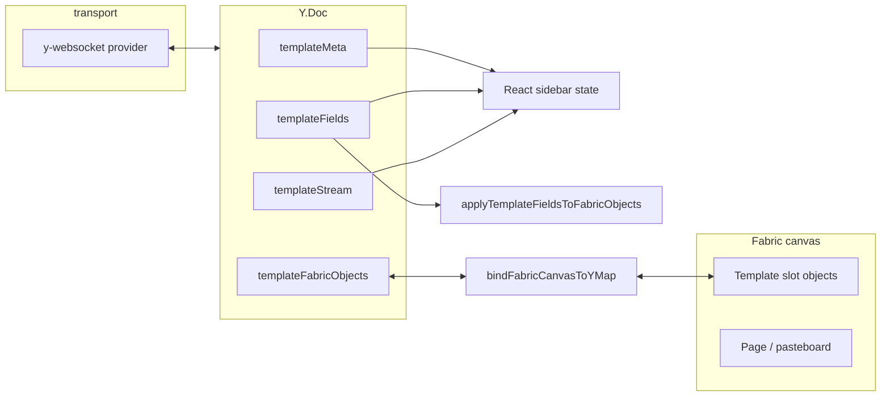

# Template editor: how syncing works

This document describes how the **template canvas** keeps **shared document state** (Yjs) and **Fabric.js** in sync across tabs and users. The main implementation lives in `packages/frontend/src/components/TemplateCanvasShell.tsx`; low-level Fabric ↔ Y.Map wiring is in `packages/frontend/src/libs/canvas/bindYjsToFabric.ts`.

## High-level architecture

- **Transport**: `WebsocketProvider` connects to the backend WebSocket URL with a **room name** derived from the template doc id (`yjs?doc=<docId>`). The same room name must be used so all clients share one `Y.Doc` state.
- **Authoritative data**: Template **copy**, **theme**, **compose progress**, and **slot geometry** are stored in Yjs maps, not only in React state. React reads maps via observers and mirrors a subset into `useState` for the UI.
- **Two kinds of “template updates”**:
  1. **Field/meta patches** (from AI compose or validation) update `templateMeta` / `templateFields` / `templateStream`. Observers refresh React and push text into Fabric via `applyTemplateFieldsToFabricObjects` or full **refit** when the template id or layout changes.
  2. **Drag/transform edits** on slot objects update **`templateFabricObjects`** through `bindFabricCanvasToYMap`, so positions and scales propagate to other tabs.

## Yjs map layout

| Map name | Constant | Purpose |
|----------|----------|---------|
| `templateMeta` | — | `templateId`, `theme`, `status`, `prompt`, `patchCount`, `initialized`, `runId`, etc. |
| `templateFields` | — | String / structured field values used to render slots (hero, steps, CTAs, …). |
| `templateStream` | — | Per-stage `done:<stageId>`, idempotency keys `op:<opId>`, error flags. |
| `templateFabricObjects` | `TEMPLATE_FABRIC_OBJECTS_MAP` in `constants/templateEditor.ts` | One entry per synced Fabric object id → `CanvasObjectRecord` (geometry + optional text metadata). |

`CanvasObjectRecord` is defined in `types/canvas.ts`. For template sync, records may include **`coordSpace: 'page'`** so stored `left` / `top` are **relative to the template page origin**, not absolute canvas coordinates (see below).

## First tab vs joining tab

Initialization **must not** run against an empty local doc before the server state is merged, or a second tab could overwrite a shared document.

Flow on **`provider.on('sync', true)`** (`TemplateCanvasShell.tsx`):

1. Read **`alreadyInitialized = (metaMap.get('initialized') === true)`** *before* any new write (this reflects merged server state after sync).
2. In a single `ydoc.transact`, if `initialized` is still not set, seed **default meta**, **default fields**, and set **`initialized`** to `true`.
3. Call **`syncLocalFromMaps()`** so React matches the doc.
4. Call **`startComposeStream()`** only when **`!alreadyInitialized`**.  
   - First client opening a **new** room: seeds the doc and starts compose.  
   - Second client: sees `initialized` from the network → **does not** auto-start compose again.

Manual **Regenerate** always calls `startComposeStream()` from the button handler.

## AI compose stream and Yjs

`startComposeStream()`:

- Aborts any previous stream, allocates a **`runId`**, and sets **`replaceFieldsPendingRunRef`** to that id.
- Writes streaming status into `templateMeta` / `templateStream`.
- Consumes SSE (or similar) events; each applied patch goes through **`applyValidatedPatch`**, which:
  - Validates the patch.
  - Dedupes with **`streamMap.get('op:' + opId)`**.
  - Applies **`meta`** / **`fields`** updates inside `ydoc.transact`.

For the **first `field_patch`** of a run, **`replaceAllFields: true`** clears fields to a **blank template** (`createBlankTemplateFields`) before applying the patch, so a new composition does not merge on top of stale slot values.

## Fabric ↔ Y.Map binding (`bindFabricCanvasToYMap`)

Implemented in `libs/canvas/bindYjsToFabric.ts`.

- **Remote → canvas**: Observing the Y.Map runs **`applyFromYjs`**, which creates/updates/removes Fabric objects by id (`ensureObjectForRecord` / `applyRecordToObject` from `fabricRecords.ts`). Multi-key updates may animate position changes.
- **Canvas → remote**: Fabric events (`object:modified`, `object:moving`, `text:changed`, etc.) serialize the object and **`ymap.set(id, record)`**. While `applyFromYjs` is running, **`applyingRemote`** blocks echo writes to avoid feedback loops.
- **`mouse:up`**: Flushes the active selection so the final transform is committed to Yjs.
- **Group / sub-target editing**: `resolveSyncTargetObject` resolves the object that owns the synced **id** (e.g. child of a group) so updates target the correct map entry.

### Template-specific options (`TemplateCanvasShell`)

- **`shouldPreserveObject`**: If the map has no entry for an id, do **not** remove objects that are **template slots** (so artboard/page rects are not torn down as “unknown” ids).
- **`shouldSyncObject`**: Only objects that are **template slots** (`isTemplateSlotFabricObject`) **and** only when **`canSyncTemplateObjectsRef`** is `true` are written to Yjs. This prevents internal layout/refit from flooding the map with transient coordinates.
- **`mapRecordForUpsert`**: Converts serialized Fabric positions to **page-relative** `left` / `top` and sets **`coordSpace: 'page'`**.
- **`mapRecordForApply`**: Adds the current **`pageOffsetRef`** (`pageX`, `pageY`) back when applying `coordSpace: 'page'` records. Records **without** `coordSpace` are treated as legacy **absolute** canvas coordinates.  
  For **`slot:final:cta`**, **`scaleX` / `scaleY`** are forced to **`1`** to avoid bad scale state from collaboration.

**`pageOffsetRef`** is updated whenever the template page is centered or refitted (`setupTemplateArtboard`, `refitTemplateSceneAndRender`, resize handling) so page-relative storage stays consistent across viewports.

## When Fabric updates from fields vs from Y.Map

- **`onMeta`**: Updates React +, if **`templateId`** changed, **`syncFabricLayoutForTemplateChange`** refits the scene, updates `pageOffsetRef`, **`applyFromYjs`**, then fits the viewport.
- **`onFields`**: Updates React + **`syncFabricTextFromFields`** — either refits if there are no slot objects yet, or **`applyTemplateFieldsToFabricObjects`** for in-place text updates.
- **Resize / debounced layout**: Refits the scene, then **`applyFromYjs`** so remote slot geometry matches the new page position.

During any **refit** path, **`canSyncTemplateObjectsRef`** is set to **`false`** before layout and back to **`true`** after **`applyFromYjs`**, so only intentional user edits sync.

## React / Fabric mount ordering

`FabricCanvas` calls **`onReady`** from a `useLayoutEffect` inside the child. The parent wires **`Y.Doc` maps** in its own `useLayoutEffect`. In typical React ordering, parent layout effects run before child layout effects, so **maps usually exist before `onReady`**.

If **`onReady`** runs before maps are ready, the canvas is stored in **`pendingFabricCanvasRef`**. **`yjsMountEpoch`** increments when the Yjs effect attaches maps; a **`useEffect`** retries **`handleFabricReady`** once refs exist. **`handleFabricReady`** guards against double setup if a binding already exists.

## Operational notes

- **Doc id**: `props.docId` (or `template-default`) selects the **WebSocket room** and remounts the Fabric canvas when it changes (`key={stableDocKey}`).
- **Idempotency**: Stream ops use `op:<opId>` in `templateStream` so duplicate events do not double-apply.
- **Related helper**: `bindYjsToFabricCanvas` in the same file is a **standalone** demo-style binding that creates its own `Y.Doc` and provider; the template editor uses **`bindFabricCanvasToYMap`** with the shell’s shared doc instead.

---

*Last updated to match the implementation in `TemplateCanvasShell` and `bindFabricCanvasToYMap`.*
